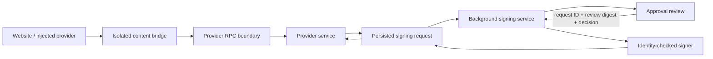

# Wallet architecture

XCP Wallet uses WXT, React, and TypeScript. The background context owns decrypted wallet state
and signing; popup and side-panel pages call explicit service methods. Chrome uses a service
worker, while the current Firefox build uses a background page. Chrome may suspend idle workers.
Session metadata and request records support recovery without relying on timers or in-memory
promises surviving.

## Code map

| Location | Responsibility |
| --- | --- |
| `src/entrypoints` | Injected provider, isolated content bridge, background startup, popup and side-panel entry points |
| `src/services` | Wallet, connection, approval, and provider operations |
| `src/platform/proxy.ts` | Sender-scoped RPC method exposure and read-only reconnect policy |
| `src/platform/walletManager.ts` | Serialized vault mutations, wallet selection, final signing identity checks |
| `src/platform/auth` | Session generations, inactivity and absolute deadlines, secret lifetime |
| `src/platform/provider` | Typed signing lifecycle, identity permissions, request correlation |
| `src/platform/storage` | Browser storage boundaries and serialized writes |
| `src/core/bitcoin`, `src/core/counterparty` | Transaction parsing, proofs, verification, money movement, signing |
| `src/core/hardware` | Device integration and transaction integrity checks |
| `src/hooks`, `src/pages`, `src/components` | UI state, review presentation, user decisions |

## Website requests

The RPC boundary derives the website origin from the browser's `MessageSender`, requires the
top frame, and rejects opaque or mismatched origins. HTTPS and local HTTP development origins
are supported. Content scripts may call only `ProviderService.handleRequest`; wallet, approval,
and signing service ports require an extension page sender. Every remotely callable method has
an explicit declaration. Undeclared methods, including inherited object methods, and arbitrary
event relays are unavailable.

RPC retries only declared reads and an explicit provider query allowlist after a lost port.
Commands such as signing, broadcasting, password changes, and wallet creation are not replayed.
A command failure after response loss can mean it completed: callers reconcile stored state
instead of assuming the operation never happened.

## Signing decisions

`ProviderSigningService` loads and verifies the persisted request, produces the review, and owns
execution. The popup sends a decision bound to that review's SHA-256 digest. It never supplies
transaction bytes or a claimed signed result to complete the provider request.

The request lifecycle is `pending → signing → completed`, or cancellation. Records retain their
original ten-minute deadline. A completed result has a kind-specific payload; a claimed signing
request cannot be executed twice. Request correlation includes origin, method, parameters, wallet,
and address. Closing a pending prompt cancels that request; losing a popup while an approved
signer is running does not grant another invocation permission to sign again.

Execution repeats identity, connection, paired-address permission, transaction verification,
and risk-acknowledgement checks. The signer checks the captured session generation at key use,
including after asynchronous previous-output lookups. A changed review must be presented again.

Live completion, polling, and completed-result recovery share delivery authorization checks.
The persisted terminal record is authoritative; completion events only wake the waiting caller.
Immediately before the background emits or returns a result, a synchronous guard checks the
current wallet identity, ordinary and paired-address grants, captured session generation, and
original request deadline. If delivery is refused after completion was persisted, that completed
record remains available until its original deadline for an authorized retry without signing again.
These checks apply at background result exposure; persistence and receipt by the website are
separate steps, so a lost response does not prove that signing failed.

Bitcoin amounts and destination scripts come from transaction bytes. A remote decoder cannot
label an unknown output as wallet change or as the requested payment recipient. Counterparty
ledger facts, including attached balances and asset metadata, still depend on configured APIs;
unknown or inconsistent facts must remain visible to policy.

Hardware conversion and returned transactions must preserve the unsigned serialization: version,
locktime, input outpoints and sequences, and output scripts and amounts. Software reconstruction
uses the same invariant. Device adapters reject script forms they cannot represent exactly.

## Vault and session state

The background wallet manager serializes vault mutations. Persistence encrypts an immutable
keychain snapshot, and asynchronous mutation steps check the generation before continuing.
Locking invalidates pending work immediately. Password rotation shares this serialization with settings and wallet
changes, preventing writes using an old key from overwriting the newly encrypted vault.
Decryption validates the versioned keychain schema before exposing settings or wallet records.

Session metadata writes are serialized, and timeout changes update the persisted inactivity
deadline as well as the alarm. The eight-hour absolute cap remains independent of user activity.
Alarms recheck the current generation and deadline, so an old alarm cannot lock a renewed session.
Idle keep-alive alarms are removed; restoration and persisted deadlines handle suspension.

## Type and lint contracts

RPC envelopes enter as `unknown` and are validated before dispatch. Persisted signing states and
results are discriminated unions. Wallet events map event names to payload types, with rejection
handling for asynchronous listeners. TypeScript's strict checks remain enabled.

Chrome port results use an explicit, lossless tagged encoding for bigint quantities and byte
arrays. Both containers and scalar values are tagged, so ordinary objects cannot impersonate
encoded types. Hashing a review also preserves these types rather than rounding quantities.

`npm run lint` runs Biome, Oxlint, and the type-aware `no-floating-promises` and
`no-misused-promises` rules. `lint-baseline.json` starts from commit `a040c6d4` and records legacy
warning counts per file and rule. New files have zero allowance; `lint:prune` can only lower budgets.
This is incremental enforcement, not a claim that every legacy React or promise warning is fixed.
Handle failures or propagate promises when changing affected code; adding `void` alone does not
handle a rejection.

## Reviewing changes

Review a complete operation across its boundaries, as well as its individual functions. For
each signing or vault change, identify the owner, the exact data being authorized, the state
that may change during each `await`, and the behavior after a lost response or worker restart.

Regression tests should assert the resulting invariants: reviewed bytes equal signed bytes;
background result exposure requires current grants, matching identity, and an unexpired request;
concurrent vault writes cannot mix encryption keys; and real decoded values survive browser serialization.
Use real parsers and cryptography for those boundaries, with controlled external API responses.
Browser approval tests must initialize the wallet fixture, require a successful decision and
result, and run with normal browser security enabled. Merely observing a popup or an error
does not demonstrate a working approval flow.

## Reference patterns

Read-only comparison with MetaMask Core at commit `f6768d71cd5f6fd0d5d01fa85134be41463ce17e`
supported several choices without introducing its controller framework:

- [Permission middleware](https://github.com/MetaMask/core/blob/f6768d71cd5f6fd0d5d01fa85134be41463ce17e/packages/permission-controller/src/permission-middleware.ts): bind the origin once, then route restricted methods through permission checks.
- [Messenger](https://github.com/MetaMask/core/blob/f6768d71cd5f6fd0d5d01fa85134be41463ce17e/packages/messenger/src/Messenger.ts): explicitly delegate permitted actions and events.
- [Approval controller](https://github.com/MetaMask/core/blob/f6768d71cd5f6fd0d5d01fa85134be41463ce17e/packages/approval-controller/src/ApprovalController.ts): accept an identified request separately from the resulting operation. XCP retains persisted request recovery because its worker lifecycle requires it.
- [Keyring controller](https://github.com/MetaMask/core/blob/f6768d71cd5f6fd0d5d01fa85134be41463ce17e/packages/keyring-controller/src/KeyringController.ts): coordinate mutation and persistence under one owner.

These changes are defensive engineering and regression coverage, not an independent security audit.
See [AUDIT.md](AUDIT.md) for the broader threat model and remaining limitations.
