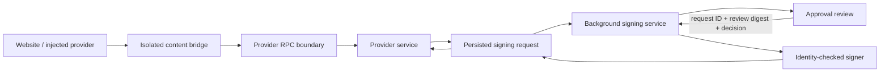

# Wallet architecture

XCP Wallet uses WXT, React, and TypeScript. The background context owns decrypted wallet state
and signing; popup and side-panel pages call explicit service methods. The extension is built
for Chrome (Chromium) only. Its background is a Manifest V3 service worker, which Chrome may
suspend when idle.
Session metadata and request records support recovery without relying on timers or in-memory
promises surviving.

## Code map

| Location | Responsibility |
| --- | --- |
| `src/entrypoints` | Injected provider, isolated content bridge, background startup, popup and side-panel entry points |
| `src/services` | Wallet, connection, approval, and provider operations |
| `src/platform/proxy` | Service RPC: `server.ts` (sender-scoped method exposure, background only), `client.ts` (page-side proxy and read-only reconnect policy), `protocol.ts` (what both agree on) |
| `src/platform/walletManager.ts` | Serialized vault mutations, wallet selection, final signing identity checks |
| `src/platform/auth` | Session generations, inactivity and absolute deadlines, secret lifetime |
| `src/platform/provider` | Typed signing lifecycle, identity permissions, request correlation |
| `src/platform/storage` | Browser storage boundaries and serialized writes |
| `src/core/bitcoin`, `src/core/counterparty` | Transaction parsing, proofs, verification, money movement, signing |
| `src/core/hardware` | Device integration and transaction integrity checks |
| `src/hooks`, `src/pages`, `src/components` | UI state, review presentation, user decisions |

## Layers

Dependencies point one way, from the top of this list to the bottom:

1. `src/types`, `src/constants`: shapes and fixed values, importing nothing above them.
2. `src/core`: pure logic (parsing, proofs, verification, fee and money-movement maths). It may
   use `src/i18n`, a shared leaf, for user-facing strings; it does not touch `chrome.*` or React.
3. `src/platform`: browser APIs, storage, sessions, the wallet manager, and the RPC proxy.
4. `src/services`: the background services that own state and signing. Popup, side-panel and
   content code reach them through the `*ServiceClient` proxies, never by importing a service.
5. `src/contexts`, then `src/hooks`: React state built on the service clients.
6. `src/components`, then `src/pages`: presentation and user decisions.

`src/entrypoints` are composition roots: they wire the layers together and hold no domain logic of
their own. Keys, decrypted secrets and signing stay in the background; UI code receives reviews
and results, never key material.

## Website requests

```mermaid
flowchart LR
  Page[Website / injected provider] --> Content[Isolated content bridge]
  Content --> RPC[Provider RPC boundary]
  RPC --> Provider[Provider service]
  Provider --> Store[Persisted signing request]
  Store --> Signing[Background signing service]
  Signing --> UI[Approval review]
  UI -->|request ID + review digest + decision| Signing
  Signing --> Wallet[Identity-checked signer]
  Wallet --> Store
  Store --> Provider
```

The RPC boundary derives the website origin from the browser's `MessageSender`, requires the
top frame, and rejects opaque or mismatched origins. HTTPS and local HTTP development origins
are supported. Content scripts may call only `ProviderService.handleRequest`; wallet, approval,
and signing service ports require an extension page sender. Every remotely callable method has
an explicit declaration. Undeclared methods, including inherited object methods, and arbitrary
event relays are unavailable.

RPC retries only declared reads and an explicit provider query allowlist after a lost port.
Commands such as signing, broadcasting, password changes, and wallet creation are not replayed.
A command failure after response loss can mean it completed: callers reconcile stored state
instead of assuming the operation never happened.

## Signing decisions

`ProviderSigningService` loads and verifies the persisted request, produces the review, and owns
execution. The popup sends a decision bound to that review's SHA-256 digest. It never supplies
transaction bytes or a claimed signed result to complete the provider request.

The request lifecycle is `pending → signing → finalizing → completed`, or cancellation before
finalization. Finalization reserves completion while the approved signature's coin-lock updates
run; the signature is not yet stored or recoverable. A worker lost at that step leaves an
interrupted request until its deadline, without replaying signing or exposing the result.
Records retain their
original deadline ([request lifetime](PROVIDER.md#signing)). A completed result has a kind-specific payload; a claimed signing
request cannot be executed twice. Request correlation includes origin, method, parameters, wallet,
and address. Closing a pending prompt cancels that request; losing a popup while an approved
signer is running does not grant another invocation permission to sign again.

Execution repeats identity, connection, paired-address permission, transaction verification,
and risk-acknowledgement checks. The signer checks the captured session generation at key use,
including after asynchronous previous-output lookups. A changed review must be presented again.

Live completion, polling, and completed-result recovery share delivery authorization checks.
The persisted terminal record is authoritative; completion events only wake the waiting caller.
Immediately before the background emits or returns a result, a synchronous guard checks the
current wallet identity, ordinary and paired-address grants, captured session generation, and
original request deadline. If delivery is refused after completion was persisted, that completed
record remains available until its original deadline for an authorized retry without signing again.
These checks apply at background result exposure; persistence and receipt by the website are
separate steps, so a lost response does not prove that signing failed.

Bitcoin amounts and destination scripts come from transaction bytes. A remote decoder cannot
label an unknown output as wallet change or as the requested payment recipient. Counterparty
ledger facts, including attached balances and asset metadata, still depend on configured APIs;
unknown or inconsistent facts must remain visible to policy.

Hardware conversion and returned transactions must preserve the unsigned serialization: version,
locktime, input outpoints and sequences, and output scripts and amounts. Software reconstruction
uses the same invariant. Device adapters reject script forms they cannot represent exactly.

## Approval screens

The approval screens are the wallet's security surface: "the transaction is valid" and "the screen
explains it correctly" are separate properties, and each needs its own check. What the wallet
verifies before anything is rendered is in [PROVIDER.md](PROVIDER.md#what-this-wallet-will-sign).
The components are in `src/components/domain/approval`; the pages that compose them are under
`src/pages/requests`.

- **Summary card first.** Every approval reads top to bottom: at most one exception line
  (`ApprovalNotice`, naming the most serious item with the rest collapsed beneath it), the summary
  card (`ApprovalSummaryCard`: one headline and the key number), supporting protocol facts, then the
  transaction details, collapsed. Anything the signer needs to decide belongs in the first two
  layers; correct information in a collapsed section does not count as shown.
- **Exceptions go through Review.** A knowingly signable exception does not paint the page red. The
  footer's action becomes **Review**, which opens `ApprovalAttentionScreen` to name each
  consequence and ask for a deliberate confirmation. Yellow and red are reserved for what the
  signer can act on or must know; routine protocol facts are information.
- **Key number above the fold.** What the signer pays, receives or puts at risk is visible at the
  popup's 350x600 size without scrolling or expanding. A headline ending in an address puts the
  address on its own line, in full.
- **Grounded UTXO vocabulary.** Inputs, outputs, change, UTXO, anchor, payment, fee, sats: the words
  people already use, and a marketplace protocol's own names where it has them. No coined terms.
- **Role-aware labels.** Labels come from the signer's role in the proved analysis, never from a
  website's label: "You pay" (buyer), "You receive" (seller accepting an offer), "Your payout if
  sold" (seller listing), "You pay if accepted" (bidder), and "Change" only for true leftover
  funding. An output the signature does not commit to is never counted as coming back.
- **Label length is linted.** `npm run lint` (`lint:i18n`) fails when an approval fact label in any
  catalog is over budget: 18 half-width units beside its value, 36 on its own line above it, with
  full-width (CJK) characters counting two and a `$1` four. `fact-layout.ts` measures width the
  same way at render time; keep the two in step. A value beside its label is at most three words and 16 units, with no
  closing full stop.
- **Galleries, screen by screen.** The approval galleries render every approval state as
  screenshots ([running them](e2e/TESTING-GUIDE.md#approval-tests)). Their layout assertions do not
  replace reading the screenshots: for each affected screen, ask what is happening, where the money
  moves, whether the key number is above the fold, what is generic and what is specific to this
  transaction, and what the signer cannot see that they should.

## Vault and session state

The background wallet manager serializes vault mutations. Persistence encrypts an immutable
keychain snapshot, and asynchronous mutation steps check the generation before continuing.
Locking invalidates pending work immediately and removes the session master key; every open popup
and side panel watches that removal, so a lock made anywhere (auto-lock, session expiry, another
surface) reaches them without a message. Password rotation shares this serialization with settings and wallet
changes, preventing writes using an old key from overwriting the newly encrypted vault.
Decryption validates the versioned keychain schema before exposing settings or wallet records.

Session metadata writes are serialized, and timeout changes update the persisted inactivity
deadline as well as the alarm. The eight-hour absolute cap remains independent of user activity.
Alarms recheck the current generation and deadline, so an old alarm cannot lock a renewed session.
The only alarm is the session deadline: there are no keep-alive, periodic state-persist or
periodic update-check alarms (those older versions left are cleared once, when an update installs),
and restoration and persisted deadlines handle suspension. The popup
reports activity at most every 30 seconds, carrying the time of the last input, so the persisted
deadline still follows the user's last input rather than the report.

## Type and lint contracts

RPC envelopes enter as `unknown` and are validated before dispatch. Persisted signing states and
results are discriminated unions. Wallet events map event names to payload types, with rejection
handling for asynchronous listeners. TypeScript's strict checks remain enabled.

Chrome port results use an explicit, lossless tagged encoding for bigint quantities and byte
arrays. Both containers and scalar values are tagged, so ordinary objects cannot impersonate
encoded types. Hashing a review also preserves these types rather than rounding quantities.

`npm run lint` runs Biome, Oxlint, the type-aware `no-floating-promises` and
`no-misused-promises` rules, and `lint:i18n` (the translation catalog and approval-label checks
described in [CONTRIBUTING.md](CONTRIBUTING.md#languages)). `lint-baseline.json` starts from commit `a040c6d4` and records legacy
warning counts per file and rule. New files have zero allowance; `lint:prune` can only lower budgets.
This is incremental enforcement, not a claim that every legacy React or promise warning is fixed.
Handle failures or propagate promises when changing affected code; adding `void` alone does not
handle a rejection.

## Reviewing changes

Review a complete operation across its boundaries, as well as its individual functions. For
each signing or vault change, identify the owner, the exact data being authorized, the state
that may change during each `await`, and the behavior after a lost response or worker restart.

Regression tests should assert the resulting invariants: reviewed bytes equal signed bytes;
background result exposure requires current grants, matching identity, and an unexpired request;
concurrent vault writes cannot mix encryption keys; and real decoded values survive browser serialization.
Use real parsers and cryptography for those boundaries, with controlled external API responses.
Browser approval tests must complete the approval ([E2E testing guide](e2e/TESTING-GUIDE.md#approval-tests)).

## Reference patterns

Read-only comparison with MetaMask Core at commit `f6768d71cd5f6fd0d5d01fa85134be41463ce17e`
supported several choices without introducing its controller framework:

- [Permission middleware](https://github.com/MetaMask/core/blob/f6768d71cd5f6fd0d5d01fa85134be41463ce17e/packages/permission-controller/src/permission-middleware.ts): bind the origin once, then route restricted methods through permission checks.
- [Messenger](https://github.com/MetaMask/core/blob/f6768d71cd5f6fd0d5d01fa85134be41463ce17e/packages/messenger/src/Messenger.ts): explicitly delegate permitted actions and events.
- [Approval controller](https://github.com/MetaMask/core/blob/f6768d71cd5f6fd0d5d01fa85134be41463ce17e/packages/approval-controller/src/ApprovalController.ts): accept an identified request separately from the resulting operation. XCP retains persisted request recovery because its worker lifecycle requires it.
- [Keyring controller](https://github.com/MetaMask/core/blob/f6768d71cd5f6fd0d5d01fa85134be41463ce17e/packages/keyring-controller/src/KeyringController.ts): coordinate mutation and persistence under one owner.

These changes are defensive engineering and regression coverage, not an independent security audit.
See [AUDIT.md](AUDIT.md) for the broader threat model and remaining limitations.
