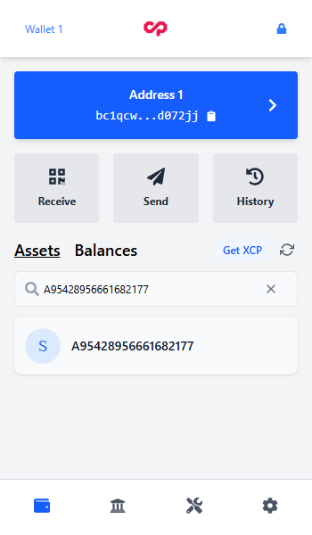
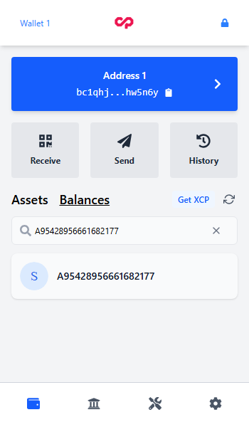
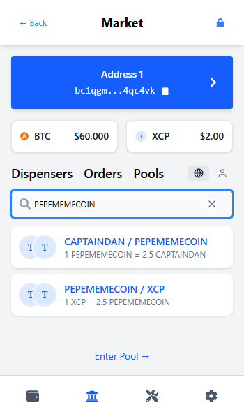
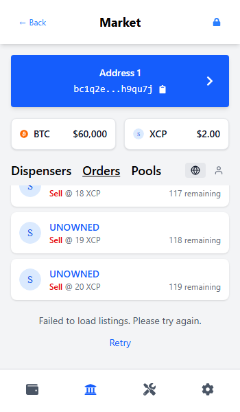
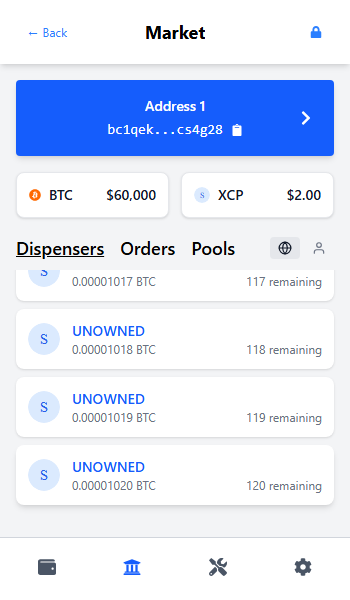
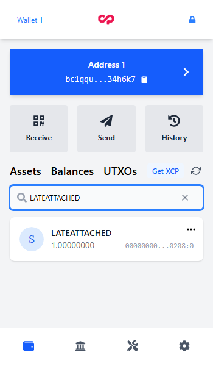

# Search and pagination QA

Validated September 8, 2026 against the production extension build
`main-C2fd6cRV.js`. All screenshots use synthetic API data, prices, icons, and
wallet addresses. Each test creates a new, unfunded wallet; only the UTXO case
supplies attached token balances. No transactions are composed, signed, or broadcast.

## Results

- 168 unit/component tests passed across 10 focused suites, with retries disabled.
- 7 browser tests passed in 45.5 seconds, using the actual built extension.
- Production build, TypeScript compilation, lint budget, and whitespace checks passed.
- No lint suppressions or baseline allowances were added.

| Area | Verified behavior |
| --- | --- |
| Assets and Balances | Global search finds an unowned asset and opens its correct detail route. An API failure shows Retry instead of a false empty result. Address/refresh races cannot update another list or its cache. |
| UTXOs | A query without first-page matches loads a delayed second page and ends its spinner. Address/refresh changes discard stale responses; failed pages can be retried. |
| Pools | Search completes across 34 pools, including matches absent from page one. Public pool details open with no LP ownership. Explore/Manage, tab/address changes, delayed responses, and retries are covered. |
| Orders and Dispensers | Asset searches reach page two; failure retains the first 20 rows and Retry reaches row 21. Managed filters find matches beyond 100 rows. Oracle filtering preserves raw offsets. |
| Market details | Asset/pair changes and refreshes isolate list/history requests. The order book is published only after all its pages load. Separate dispenses sharing a transaction hash remain visible. |
| Shared search | New-query pending state, stale responses, cancelled backoff, fetch/body timeouts, Retry-After handling, and manual Retry are covered. Subasset casing is preserved. |

These tests establish the named regression cases. Live API availability, indexing
completeness, and exhaustive application behavior are outside this fixture-based run.

## Reproduce

From the repository root:

```sh
npm run compile
npm run lint
npm run build
npx vitest run src/components/domain/asset/asset-list.test.tsx src/components/domain/balance/balance-list.test.tsx src/components/domain/utxo/utxo-list.test.tsx src/components/ui/inputs/search-input.test.tsx src/hooks/__tests__/useMarketData.test.ts src/hooks/__tests__/useSearchQuery.test.ts src/hooks/__tests__/usePaginatedFetch.test.ts src/pages/market/__tests__/pools.test.tsx src/pages/market/dispensers/__tests__/asset.test.tsx src/pages/market/orders/__tests__/pair-pagination.test.tsx --retry=0
```

The normal browser command uses the existing wallet fixture:

```sh
npx playwright test e2e/tests/list-search-pagination.spec.ts e2e/pages/market/pools.spec.ts --reporter=line
```

The recorded Windows run selected full headless Chromium using the optional
preload (the headless-shell executable cannot load the extension):

```powershell
$previousNodeOptions = $env:NODE_OPTIONS
try {
  $env:NODE_OPTIONS = '--import=./e2e/utils/headless-extension.mjs'
  npx playwright test e2e/tests/list-search-pagination.spec.ts e2e/pages/market/pools.spec.ts --reporter=line
} finally {
  $env:NODE_OPTIONS = $previousNodeOptions
}
```

Screenshots are attached to the Playwright report. To also copy them to an external
directory, set `POOL_QA_SCREENSHOT_DIR` before running.

## Screenshots

Representative captures at 350×600, visually inspected:

| Assets: unowned search | Balances: unowned search | Pools: both matching pairs |
| --- | --- | --- |
|  |  |  |

| Orders: failed page and Retry | Dispensers: recovered page two | UTXOs: later-page search match |
| --- | --- | --- |
|  |  |  |

[Public pool details without LP ownership](02-unowned-pepememecoin-xcp-pool.png).
